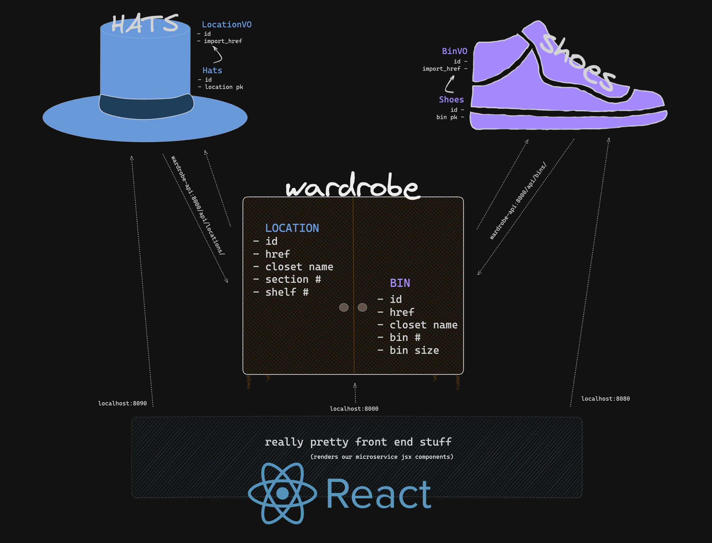

# Wardrobify

## Team:

* Dylan - Hats microservice
* Katie - Shoes microservice
## How to Run

* Clone the repository:
    $git clone <https://gitlab.com/dylan.lorinc/microservice-two-shot.git>
    $cd microservice-two-shot
    $pip install -r requirements.txt

* Run the application:
    $python manage.py runserver

* Access the application:
    open your web browser and go to http://localhost:5173/

## Diagram

* 

## URLs
* Wardrobe:
    locations - http://localhost:8100/api/locations/
    bins - http://localhost:8100/api/bins/

* Hats:
    view  - http://localhost:8090/api/hats/
    create - http://localhost:8090/api/hats/new

* Shoes:
    view - http://localhost:8080/api/shoes/
    create - http://localhost:8080/api/shoes/new

## Shoes microservice

* Shoe Model
    The shoe model represents individual shoes stored in the wardrobe, characterized by manufacturer, shoe model name, color, and Bin location. The Bin location is further defined by the BinVO model.

* Wardrobe Microservice Integration:
* Endpoints:
    GET /shoes/: Retrieve all shoes.
    POST /shoes/: Create a new shoe.
    GET /shoes/{id}/: Retrieve details of a specific shoe.
    DELETE /shoes/{id}/: Delete a specific shoe.
* Data Structure:
    Shoe:
    manufacturer (string)
    model_name (string)
    color (string)
    bin (ForeignKey to BinVO)
* Serialization:
    Uses ShoeEncoder and BinVOEncoder to serialize shoe and bin data into JSON.

## Hats microservice

* Hat Model
    The hat model represents individual hats stored in the wardrobe, characterized by style, fabric, color, and closet location. The closet location is further defined by the LocationVO model.

* Wardrobe Microservice Integration:

* Endpoints:
    GET /hats/: Retrieve all hats.
    POST /hats/: Create a new hat.
    GET /hats/{id}/: Retrieve details of a specific hat.
    DELETE /hats/{id}/: Delete a specific hat.
* Data Structure:
    Hat:
    style (string)
    fabric (string)
    color (string)
    location (ForeignKey to LocationVO)
* Serialization:
    Uses HatDetailEncoder and LocationVOEncoder to serialize hat and location data into JSON.

## Value objects

* BinVO Model:
    Represents bins inside the wardrobe where shoes are stored.
    Used to organize and manage shoe retrieval.

* LocationVO Model:
    Represents locations inside the wardrobe where hats are stored.
    Used to organize and manage hat retrieval.
